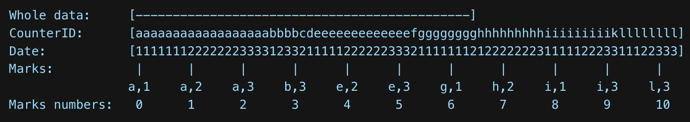

# 数据类型

[ClickHouse官网数据类型](https://clickhouse.com/docs/en/sql-reference/data-types)

# 表引擎

表引擎是ClickHouse的一大特色。表引擎决定了如何存储表的数据。包括：

* 数据的存储方式和位置，写到哪里以及从哪里读取数据。
* 支持哪些查询以及如何支持。
* 并发数据访问。
* 索引的使用,如果存在。
* 是否可以执行多线程请求。
* 数据复制参数。

表引擎的使用方式就是必须显式在创建表时定义该表使用的引擎，以及引擎使用的相关参数。

**⚠️ 引擎的名称大小写敏感**

[详细表引擎列表参考官网](https://clickhouse.com/docs/en/engines/table-engines)，只记录常见以及常用的表引擎

## MergeTree Family

MergeTree 系列的表引擎是 ClickHouse 数据存储功能的核心。它们提供了弹性和高性能数据检索的大部分功能：列式存储、自定义分区、稀疏主索引、辅助数据跳跃索引等。

基础[MergeTree](https://clickhouse.com/docs/en/engines/table-engines/mergetree-family/mergetree)表引擎可以被视为单节点 ClickHouse 实例的默认表引擎，因为它对于广泛的用例来说是通用且实用的。

对于生产使用，[ReplicatedMergeTree](https://clickhouse.com/docs/en/engines/table-engines/mergetree-family/replication)是最佳选择，因为它为常规 MergeTree 引擎的所有功能添加了高可用性。一个好处是数据摄取时自动重复数据删除，因此如果插入过程中出现一些网络问题，软件可以安全地重试。

MergeTree 系列的所有其他引擎都为某些特定用例添加了额外的功能。通常，它是作为后台额外的数据操作来实现的。

MergeTree 引擎的主要缺点是它们相当重量级。如果您需要许多小表，例如临时数据，请考虑[日志引擎系列](https://clickhouse.com/docs/en/engines/table-engines/log-family)。

### MergeTree

MergeTree 家族中的引擎设计**用于向表中插入大量数据**。数据被快速地一部分一部分地写入到表中，然后应用规则在后台合并这些部分。这种方法比在插入期间不断地重写存储中的数据要有效得多。

**主要特性**

* Stores data sorted by primary key.

  这允许您创建一个小的稀疏索引，有助于更快地查找数据。

* Partitions can be used if the [partitioning key](https://clickhouse.com/docs/en/engines/table-engines/mergetree-family/custom-partitioning-key) is specified.

  ClickHouse支持特定分区的操作，比在相同数据上进行通用操作的效率更高，并且查询结果是相同的。如果在查询中指定分区键，ClickHouse会自动削减分区数据。

* Data replication support.

  ReplicatedMergeTree 表家族提供数据复制。有关详细信息，请参阅[Data replication](https://clickhouse.com/docs/en/engines/table-engines/mergetree-family/replication)

* Data sampling support.

  如有必要，您可以在表中设置数据采样方法。

**DDL Syntax**

https://clickhouse.com/docs/en/engines/table-engines/mergetree-family/mergetree#table_engine-mergetree-creating-a-table

**参数详解：**

* `ENGINE` — 引擎的名称和参数。

  `ENGINE = MergeTree()`。引擎`MergeTree`没有参数。

* `ORDER BY` — 排序键值对。

  列名或任意表达式的元组。例子：`ORDER BY (CounterID, EventDate)`。

  如果子句未显式定义主键，ClickHouse 会使用排序键作为主键`PRIMARY KEY`。

  ⚠️ 如果不需要排序，则使用该语法 `ORDER BY tuple()`，或者将`create_table_empty_primary_key_by_default`设置为默认`true`。

* `PARTITION BY` — 分区键。

  可选项。在大多数情况下，不需要分区键，而如果确实需要进行分区，通常情况下分区键的粒度不应比按月更细。分区不能加快查询速度（与ORDER BY表达式相反）。

  对于按月分区，请使用`toYYYYMM(date_column)`表达式，其中`date_column`是具有`Date类型`的日期列。这里的分区名称采用`YYYYMM`格式。

  ⚠️ 在ClickHouse的MergeTree表引擎中，分区键（PARTITION BY子句指定的列）主要用于数据的物理存储和维护。虽然分区键能够帮助在数据插入时提高性能，但并不直接用于查询性能的提升。

  分区键的主要作用是在数据的物理存储上进行优化，将相似的数据存储在相邻的位置。这样一来，在执行某些查询时，ClickHouse可以跳过不相关的分区，提高查询效率。但并不是所有查询都能够从分区键的优化中受益，尤其是在涉及大多数分区的查询时，性能的提升可能并不明显。

  ClickHouse主要通过对数据进行排序（SortKey）和使用MergeTree引擎的其他优化技术（如Bloom Filter）来提高查询性能。分区键则更关注数据的存储结构和插入性能。

  总体来说，虽然分区键对于某些查询可能有帮助，但在ClickHouse中，其他引擎和优化策略更直接地影响查询性能。

* `PRIMARY KEY` — 如果与排序键不同，则为主键。可选项。

  默认情况下，主键与排序键相同（由ORDER BY子句指定）。因此，在大多数情况下，不需要指定单独的PRIMARY KEY子句。

* `TTL` — 一组规则，指定行的存储持续时间，并定义自动将这过期数据数据移动到磁盘或卷的逻辑。可选项。

  参阅[TTL for columns and table](https://clickhouse.com/docs/en/engines/table-engines/mergetree-family/mergetree#table_engine-mergetree-ttl)。

  表达式必须以一个`Date`或`DateTime`列作为结果。例如：

  ```sql
  -- Column TTL
  create table t_order_mt2(
      id UInt32,
      sku_id String,
      total_amount Decimal(16,2)  TTL create_time + interval 10 SECOND,
      create_time  Datetime 
   ) engine = MergeTree()
   partition by toYYYYMMDD(create_time)
   primary key (id)
   order by (id, sku_id);
   
   -- Table TTL
   CREATE TABLE table_with_where
  (
      d DateTime,
      a Int
  )
  ENGINE = MergeTree
  PARTITION BY toYYYYMM(d)
  ORDER BY d
  TTL d + INTERVAL 1 MONTH DELETE,
      d + INTERVAL 1 WEEK TO VOLUME 'aaa',
      d + INTERVAL 2 WEEK TO DISK 'bbb'
  		d + INTERVAL 1 MONTH YEAR WHERE toDayOfWeek(d) = 1;
  ```

* `SETTINGS` — 控制MergeTree行为的其他参数（可选）

  * `index_granularity` — 表示索引块大小的整数值。它定义了多少行数据会被包含在一个索引块中。这个值越大，每个索引块中包含的行数就越多，索引的内存占用就越小，但也可能导致某些查询性能下降。默认值：8192。 See [Data Storage](https://clickhouse.com/docs/en/engines/table-engines/mergetree-family/mergetree#mergetree-data-storage).
  * `index_granularity_bytes` — 也是一个表示索引块大小的整数值，但是以字节为单位。与`index_granularity`不同，它直接指定索引块的大小而不考虑行数。这个参数用于更直接地控制索引的内存占用。默认值：10Mb。如果仅通过行数限制颗粒大小，请设置为 0（不推荐）。 See [Data Storage](https://clickhouse.com/docs/en/engines/table-engines/mergetree-family/mergetree#mergetree-data-storage).
  * `min_index_granularity_bytes`— 是用于控制索引块最小大小的参数。如果设置了这个参数，ClickHouse将保证索引块的大小不会低于指定的字节值。这有助于避免过小的索引块，从而提高查询性能。默认值：1024b。提供保护，防止意外创建索引粒度非常低的表。See [Data Storage](https://clickhouse.com/docs/en/engines/table-engines/mergetree-family/mergetree#mergetree-data-storage).
  * ...

  [详细seetings列表参考官网](https://clickhouse.com/docs/en/engines/table-engines/mergetree-family/mergetree#settings)

  **Example of Sections Setting**

  ```sql
  ENGINE MergeTree() PARTITION BY toYYYYMM(EventDate) ORDER BY (CounterID, EventDate, intHash32(UserID)) SAMPLE BY intHash32(UserID) SETTINGS index_granularity=8192
  ```

#### [Data Storage](https://clickhouse.com/docs/en/engines/table-engines/mergetree-family/mergetree#mergetree-data-storage)

一张表由多个按照`primary key`排序的数据部分组成。

在表中插入数据时，将创建单独的数据部分，并按主键对每个数据部分进行字典排序。例如，如果主键是`(CounterID，Date)` ，则部件中的数据按` CounterID` 排序，并且在每个 `CounterID` 中按 `Date `排序。

属于不同分区的数据被分成不同的部分。在后台，ClickHouse 合并数据部分以提高存储效率。不会合并属于不同分区的部分。合并机制并不保证具有相同主键的所有行都位于相同的数据部分中。

数据部分可以以`Wide`或`Compact`格式存储。在`Wide`格式中，每列都存储在文件系统中的一个单独文件中，在`Compact`格式中，所有列都存储到一个文件中。紧凑格式可用于提高小型和频繁插入的性能。

数据存储格式由表引擎的 `min_bytes_for_wide_part `和` min_rows_for_wide_part`设置控制。如果数据部分中的字节或行数小于相应设置的值，则该部分以`Compact`格式存储。否则，它将以宽格式存储。如果没有设置这些设置，则数据部分以`Wide`格式存储。

每个数据部分在逻辑上划分为颗粒。颗粒是Clickhouse选择数据时读取的最小不可分割的数据集。Clickhouse不会拆分行或值，因此每个粒度总是包含整数行数。每个颗粒的第一行带有该行的主键的值。对于每个数据部分，ClickHouse创建一个存储标记的索引文件。对于每列，无论是否在主键中，Clickhouse都会存储相同的标记。这些标记可让您直接在列文件中找到数据。

颗粒大小受表引擎的`index_granularity`和`index_granularity_bytes`设置的限制。粒度中的行数在`[1，index_granularity]`范围内放置，具体取决于行的大小。如果单行的大小大于设置的值，则粒度的大小可以超过`index_granularity_bytes`。在这种情况下，粒度的大小等于行的大小。

#### [Primary Keys and Indexes in Queries](https://clickhouse.com/docs/en/engines/table-engines/mergetree-family/mergetree#primary-keys-and-indexes-in-queries)

以`（CounterID，Date）`主键为例。在这种情况下，排序和索引可以如下所示：



If the data query specifies:

* `CounterID in ('a', 'h')`, the server reads the data in the ranges of marks `[0, 3)` and `[6, 8)`.
* `CounterID IN ('a', 'h') AND Date = 3`, the server reads the data in the ranges of marks `[1, 3)` and `[7, 8)`.
* `Date = 3`, the server reads the data in the range of marks `[1, 10]`.

上面的例子表明，使用索引总是比全扫描更有效。

稀疏索引允许读取额外的数据。当读取主键的单个范围时，最多可以读取每个数据块中的`index_granularity * 2`个额外行。

稀疏索引允许您处理非常多的表行，因为在大多数情况下，这样的索引适合计算机的 RAM。

ClickHouse不要求表中的主键（primary key）具有唯一性，允许在表中插入多行具有相同主键值的数据。

⚠️ You can use `Nullable-typed` expressions in the `PRIMARY KEY` and `ORDER BY` clauses but it is strongly discouraged. To allow this feature, turn on the [allow_nullable_key](https://clickhouse.com/docs/en/operations/settings/settings#allow-nullable-key) setting. The [NULLS_LAST](https://clickhouse.com/docs/en/sql-reference/statements/select/order-by#sorting-of-special-values) principle applies for `NULL` values in the `ORDER BY` clause.

#### 主键选择

主键的个数并没有明确的限制，主要取决于以下几个因素：

* 优化索引

   如果主键是`(a, b)`, 如果遇见下面的情况，那么增加一个字段 `c` 将会起到优化效果:

  * 查询的条件语句中用到了`c`列

  * `（a，b）`具有相同值的长数据范围（比`index_granularity`长几倍）是常见的。换句话说，当添加另一列时，可以跳过相当长的数据范围。

  * 在 [CollapsingMergeTree](https://clickhouse.com/docs/en/engines/table-engines/mergetree-family/collapsingmergetree#table_engine-collapsingmergetree) 和 [SummingMergeTree](https://clickhouse.com/docs/en/engines/table-engines/mergetree-family/summingmergetree) 引擎中合并数据部分时提供附加逻辑。

    在这种情况下，指定不同于主键的排序键是有意义的。

长主键会对插入性能和内存消耗产生负面影响，但是主键中的额外列不会影响 ClickHouse的`select`性能。

可以使用`ORDERBY tuple ()`语法创建没有主键的表。在本例中，ClickHouse按照插入的顺序存储数据。如果希望在通过INSERT... SELECT 查询插入数据时保存数据顺序，请设置`max_INSERT_thread` = 1。

若要按初始顺序SELECT数据，请使用单线程SELECT 查询。

#### 选择一个与Sorting Key不同的Primary Key

可以指定一个与排序键`(用于对数据块中的数据进行排序的表达式)`不同的主键`(一个表达式，其值被写入索引文件以标记每个块)`。在这种情况下，主键表达式的元组必须是排序键表达式元组的前缀。

在使用`SummingMergeTree`和`AggregatingMergeTree`表引擎时，这个功能非常有帮助。在通常情况下使用这些引擎时，表具有两种类型的列：维度和度量。典型查询会按度量列进行`GROUP BY`聚合，并通过维度列进行过滤。由于`SummingMergeTree`和`AggregatingMergeTree`自动根据`Sort key`聚合，因此将所有维度添加到排序键中是自然的选择。因此，键表达式由一长串列组成，这个列表必须频繁地更新以包括新添加的维度。

在这种情况下，只有将一些列保留在主键中才有意义，以提供高效的范围扫描，并将其余的维度列添加到排序键元组中。

**对排序键进行ALTER是一个轻量级的操作，因为当新列同时添加到表和排序键中时，现有的数据部分不需要被更改。由于旧的排序键是新排序键的前缀，并且新添加的列中没有数据，所以在表修改的时候数据同时按照旧的和新的排序键进行排序。**

#### [查询中索引以及分区的使用](https://clickhouse.com/docs/en/engines/table-engines/mergetree-family/mergetree#use-of-indexes-and-partitions-in-queries)

对于`SELECT`查询，ClickHouse会分析是否可以使用索引。如果`WHERE/PREWHERE`子句具有表示等式或不等式比较操作的表达式（作为多个连接元素之一，或完全包含在内），或者如果有基于`主键`或`分区键`的表达式上有固定前缀的`IN`或`LIKE`操作，那么可以使用索引。

因此，可以在主键的一个或多个范围上快速运行查询。在此示例中，当针对特定的跟踪标签、特定标签和日期范围、特定标签和日期，以及带有日期范围的多个标签运行查询时，查询将会非常快速。

**engine configured as follows:**

```sql
ENGINE MergeTree()
PARTITION BY toYYYYMM(EventDate)
ORDER BY (CounterID, EventDate)
SETTINGS index_granularity=8192
```

**sample queries**

```sql
SELECT count() FROM table
WHERE EventDate = toDate(now())
AND CounterID = 34

SELECT count() FROM table
WHERE EventDate = toDate(now())
AND (CounterID = 34 OR CounterID = 42)

SELECT count() FROM table
WHERE ((EventDate >= toDate('2014-01-01')
AND EventDate <= toDate('2014-01-31')) OR EventDate = toDate('2014-05-01'))
AND CounterID IN (101500, 731962, 160656)
AND (CounterID = 101500 OR EventDate != toDate('2014-05-01'))
```

`ClickHouse`将使用主键索引来修剪不正确的数据，使用月分区键来修剪日期范围不正确的分区。

上面的查询表明，索引甚至用于复杂的表达式。从表中读取是有组织的，因此使用索引不会比完全扫描慢。

在下面的示例中，不能使用索引。

```sql
SELECT count() FROM table WHERE CounterID = 34 OR URL LIKE '%upyachka%'
```


要在运行查询时检查ClickHouse是否可以使用索引，请使用设置[force_index_by_date](https://clickhouse.com/docs/en/operations/settings/settings#settings-force_index_by_date)和[force_primary_key](https://clickhouse.com/docs/en/operations/settings/settings#force-primary-key)。

按月份进行分区的键允许仅读取包含适当范围内日期的数据块。在这种情况下，数据块可以包含多个日期的数据（最多整个月份的数据）。在块内，数据按主键排序，该主键可能不包含日期作为第一列。因此，对于仅包含日期条件但未指定主键前缀的查询，将会读取比仅仅查询单个日期更多的数据。

#### [Data Skipping Indexes](https://clickhouse.com/docs/en/engines/table-engines/mergetree-family/mergetree#table_engine-mergetree-data_skipping-indexes)

> 在`MergeTree`引擎中，`Data Skipping Indexes（数据跳过索引）`是一种索引结构，用于加速查询时的数据跳过（Data Skipping）操作。数据跳过是指在查询过程中，根据查询条件和索引的信息，跳过不符合条件的数据块（block），从而减少需要扫描的数据量，提高查询性能。
>
> Data Skipping Indexes基于数据块的最小值和最大值信息，以及每个数据块中指定列的最小值和最大值范围，构建了一个有序的索引结构。该索引结构可以帮助ClickHouse在查询过程中快速确定哪些数据块不包含满足查询条件的数据，从而避免对这些数据块进行不必要的扫描。
>
> 通过使用`Data Skipping Indexes`，ClickHouse可以在查询时更高效地跳过大量的数据块，只扫描包含可能符合查询条件的数据块，从而显著减少IO操作和数据传输量，提高查询性能。特别是在具有大量数据和广泛过滤条件的情况下，`Data Skipping Indexes`可以带来显著的性能优势。
>
> 需要注意的是，`Data Skipping Indexes`在`MergeTree`表中是可选的，并且需要在表创建时明确启用。可以使用`MergeTree`引擎的`INDEX`选项来定义和启用`Data Skipping Indexes`。

索引的声明位于`CREATE`语句的`columns`部分。

```sql
INDEX index_name expr TYPE type(...) [GRANULARITY granularity_value]
```

对于属于`*MergeTree`系列的表，可以指定数据跳过索引。

这些索引在块上聚合了有关指定表达式的一些信息，这些块由`granularity_value`颗粒组成（粒度的大小由表引擎中的`index_granularity`设置指定）。然后，这些聚合在SELECT查询中被用来减少从磁盘读取的数据量，通过跳过无法满足WHERE查询条件的大块数据。

`GRANULARITY`子句可以省略，`granularity_value`的默认值为1。

**Example**

```sql
CREATE TABLE table_name
(
    u64 UInt64,
    i32 Int32,
    s String,
    ...
    INDEX idx1 u64 TYPE bloom_filter GRANULARITY 3,
    INDEX idx2 u64 * i32 TYPE minmax GRANULARITY 3,
    INDEX idx3 u64 * length(s) TYPE set(1000) GRANULARITY 4
) ENGINE = MergeTree()
...
```

可以使用示例中的索引来减少在以下查询中从磁盘读取的数据量:

```sql
SELECT count() FROM table WHERE u64 == 10;
SELECT count() FROM table WHERE u64 * i32 >= 1234
SELECT count() FROM table WHERE u64 * length(s) == 1234
```

还可以在复合列上创建数据跳过索引：

```sql
-- on columns of type Map:
INDEX map_key_index mapKeys(map_column) TYPE bloom_filter
INDEX map_value_index mapValues(map_column) TYPE bloom_filter

-- on columns of type Tuple:
INDEX tuple_1_index tuple_column.1 TYPE bloom_filter
INDEX tuple_2_index tuple_column.2 TYPE bloom_filter

-- on columns of type Nested:
INDEX nested_1_index col.nested_col1 TYPE bloom_filter
INDEX nested_2_index col.nested_col2 TYPE bloom_filter
```

更多Data Skipping Indexes类型请参考[Available Types of Indices](https://clickhouse.com/docs/en/engines/table-engines/mergetree-family/mergetree#available-types-of-indices)

#### [TTL for Columns and Tables](https://clickhouse.com/docs/en/engines/table-engines/mergetree-family/mergetree#table_engine-mergetree-ttl)

可以为整表和每个单独的列设置`TTL`子句。表级`TTL`还可以定义在磁盘和卷之间自动移动数据的逻辑，或重新压缩所有过期部分的数据。

表达式的计算结果必须为`Date`或`DateTime`数据类型。

**Syntax**

To define `interval`, use [time interval](https://clickhouse.com/docs/en/sql-reference/operators#operators-datetime) operators, for example:

```sql
TTL date_time + INTERVAL 1 MONTH
TTL date_time + INTERVAL 15 HOUR
```

##### [Column TTL](https://clickhouse.com/docs/en/engines/table-engines/mergetree-family/mergetree#mergetree-column-ttl)

当列中的值过期时，ClickHouse将它们替换为列数据类型的默认值。如果数据部分中的此列所有值都过期，ClickHouse将从文件系统中的数据部分中删除该列。

TTL语句不能使用在主键列上。

**Examples**

Creating a table with `TTL`:

```sql
CREATE TABLE example_table
(
    d DateTime,
    a Int TTL d + INTERVAL 1 MONTH,
    b Int TTL d + INTERVAL 1 MONTH,
    c String
)
ENGINE = MergeTree
PARTITION BY toYYYYMM(d)
ORDER BY d;
```

Adding TTL to a column of an existing table:

```sql
ALTER TABLE example_table
    MODIFY COLUMN
    c String TTL d + INTERVAL 1 DAY;
```

Altering TTL of the column:
```sql
ALTER TABLE example_table
    MODIFY COLUMN
    c String TTL d + INTERVAL 1 MONTH;
```

##### [Table TTL](https://clickhouse.com/docs/en/engines/table-engines/mergetree-family/mergetree#mergetree-table-ttl)

`Table`可以有一个用于删除过期行的表达式，以及多个用于在磁盘或卷之间自动移动部分的表达式。当表格中的行过期时，ClickHouse会删除所有对应的行。对于部分的移动或重新压缩，部分的所有行都必须满足TTL表达式的条件。

```sql
TTL expr
    [DELETE|RECOMPRESS codec_name1|TO DISK 'xxx'|TO VOLUME 'xxx'][, DELETE|RECOMPRESS codec_name2|TO DISK 'aaa'|TO VOLUME 'bbb'] ...
    [WHERE conditions]
    [GROUP BY key_expr [SET v1 = aggr_func(v1) [, v2 = aggr_func(v2) ...]] ]
```

`TTL`规则的类型可以跟在每个TTL表达式后面。它会影响满足表达式（达到当前时间）后要执行的操作：

* `DELETE` - delete expired rows (default action);
* `RECOMPRESS codec_name` - recompress data part with the `codec_name`;
* `TO DISK 'aaa'` - move part to the disk `aaa`;
* `TO VOLUME 'bbb'` - move part to the disk `bbb`;
* `GROUP BY` - aggregate expired rows.

`DELETE` 操作可以与` WHERE `子句一起使用，根据筛选条件只删除一些过期的行:

```sql
TTL time_column + INTERVAL 1 MONTH DELETE WHERE column = 'value'
```

`GROUP BY`表达式必须是表主键的前缀。

如果某一列不是`GROUP BY`表达式的一部分，并且在SET子句中没有明确设置，那么在结果行中，它将包含来自分组行的任意值（就好像对它应用了任意的聚合函数）。

**Example**

创建一个表，在其中聚合过期的行。结果行中，`x`包含分组行中的最大值，`y`表示最小值，`d`表示分组行中偶尔出现的值。

```sql
CREATE TABLE table_for_aggregation
(
    d DateTime,
    k1 Int,
    k2 Int,
    x Int,
    y Int
)
ENGINE = MergeTree
ORDER BY (k1, k2)
TTL d + INTERVAL 1 MONTH GROUP BY k1, k2 SET x = max(x), y = min(y);
```

其他usages请参考[官网](https://clickhouse.com/docs/en/engines/table-engines/mergetree-family/mergetree#mergetree-table-ttl)。

##### Removing Expired Data

当ClickHouse合并数据分区时，具有过期TTL的数据将会被删除。

当ClickHouse检测到数据已过期时，它会执行一个非计划的合并操作。为了控制这类合并的频率，您可以设置`merge_with_ttl_timeout`。如果该值设置得过低，将会执行很多非计划的合并操作，可能会消耗大量资源。

如果您在合并操作之间执行`SELECT`查询，可能会获取到已过期的数据。为了避免这种情况，可以在`SELECT`之前使用`OPTIMIZE`查询。

另请参阅：[ttl_only_drop_parts](https://clickhouse.com/docs/en/operations/settings/settings#ttl_only_drop_parts) setting

#### Disk Types

除了本地块设备，`ClickHouse`还支持这些存储类型:

* [`s3` for S3 and MinIO](https://clickhouse.com/docs/en/engines/table-engines/mergetree-family/mergetree#table_engine-mergetree-s3)
* [`gcs` for GCS](https://clickhouse.com/docs/en/integrations/gcs#creating-a-disk)
* [`blob_storage_disk` for Azure Blob Storage](https://clickhouse.com/docs/en/engines/table-engines/mergetree-family/mergetree#table_engine-mergetree-azure-blob-storage)
* [`hdfs` for HDFS](https://clickhouse.com/docs/en/engines/table-engines/mergetree-family/mergetree#hdfs-storage)
* [`web` for read-only from web](https://clickhouse.com/docs/en/engines/table-engines/mergetree-family/mergetree#web-storage)
* [`cache` for local caching](https://clickhouse.com/docs/en/operations/storing-data#using-local-cache)
* [`s3_plain` for backups to S3](https://clickhouse.com/docs/en/operations/backup#backuprestore-using-an-s3-disk)

#### 使用多块设备存储数据

MergeTree系列的表引擎可以将数据存储在多个块设备上。例如，当某个表的数据被隐式地分为“热”和“冷”时，这将非常有用。最近的数据经常被请求，但只需要很小的空间。相反，历史数据很少被请求。如果有几个磁盘可用，可以将“热”数据存储在快速磁盘上（例如，NVMe SSD或内存），而将“冷”数据存储在相对较慢的磁盘上（例如，HDD）。

数据块是MergeTree引擎表的最小可移动单元。属于同一块的数据存储在一个磁盘上。数据块可以在后台移动（根据用户设置），也可以通过ALTER查询的方式进行移动。

##### Terms(术语)

* Disk — Block device mounted to the filesystem.
* Default disk — Disk that stores the path specified in the [path](https://clickhouse.com/docs/en/operations/server-configuration-parameters/settings#server_configuration_parameters-path) server setting.
* Volume — Ordered set of equal disks (similar to [JBOD](https://en.wikipedia.org/wiki/Non-RAID_drive_architectures)).
* Storage policy — Set of volumes and the rules for moving data between them.

所描述的实体的名称可以在系统表[system.storage_policies](https://clickhouse.com/docs/en/operations/system-tables/storage_policies#system_tables-storage_policies)和[system.disks](https://clickhouse.com/docs/en/operations/system-tables/disks#system_tables-disks)中找到。要为表应用其中一个配置的存储策略，使用`MergeTree`引擎系列表的`storage_policy`设置。

